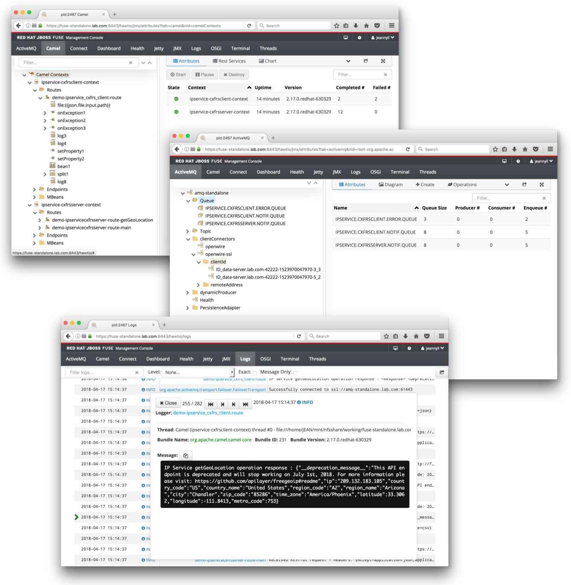

# jbossfuse-cxfrs-demo
Red Hat JBoss Fuse 6.3.0 projects to demo the usage of the camel CXFRS endpoints in order to expose or consume RESTful services running on Apache KARAF containers (RH JBoss Fuse standalone or in a Fabric8 environment)
* [ipservice\_cxfrs\_server\_swaggerv1](ipservice_cxfrs_server_swaggerv1) (```swagger v1.2```)
* [ipservice\_cxfrs\_server\_swaggerv2](ipservice_cxfrs_server_swaggerv2) (```swagger v2.0```)
* [ipservice\_cxfrs\_client](ipservice_cxfrs_client)

## :warning: WARNING:
- The *__Red Hat JBoss Fuse 6.3.0 Rollup 6 (v6.3.0.redhat-329) BOM__* is used in this project. So make sure you use the same patch version or
  adapt to your current patch version of Red Hat JBoss Fuse 6.3.0
- This project is configured to use a repository manager. 
Thus, the [parent POM](pom.xml) points to my private [Sonatype Nexus Repository OSS](https://www.sonatype.com/download-oss-sonatype).
My [Sonatype Nexus Repository OSS](https://www.sonatype.com/download-oss-sonatype) is configured to proxy the following 
Red Hat maven repositories in addition to [Maven Central](https://repo1.maven.org/maven2):
  - https://maven.repository.redhat.com/ga 
  - https://maven.repository.redhat.com/earlyaccess/all
  - Make sure you configure the [parent POM](pom.xml) to either point to
your own maven repository manager or directly to [Maven Central](https://repo1.maven.org/maven2) and
the two Red Hat maven repositories above.
- Various PID properties need to be adjusted according to your environment:
  - either within the projects blueprint for local tests with ```camel:run``` maven goal
  - either within the [parent PID](src/main/fabric8/org.jeannyil.fuse.cxfrs.demo.properties) and the following PID files for container runtime (Apache Karaf standalone or managed by Fabric8)
tests according to the tested module:
    - [ipservice\_cxfrs\_server\_swaggerv1 PID](ipservice_cxfrs_server_swaggerv1/src/main/fabric8/org.jeannyil.fuse.demo.ipservicecxfrsserver.properties)
    - [ipservice\_cxfrs\_server\_swaggerv2 PID](ipservice_cxfrs_server_swaggerv2/src/main/fabric8/org.jeannyil.fuse.demo.ipservicecxfrsserver.properties)
    - [ipservice\_cxfrs\_client PID](ipservice_cxfrs_client/src/main/fabric8/org.jeannyil.fuse.demo.ipservicecxfrsclient.properties)

## Screenshot samples

### Red Hat JBoss Fuse 6.3.0 on Apache Karaf standalone deployment 


### Red Hat JBoss Fuse 6.3.0 on Apache Karaf deployment as a fabric8 cluster
